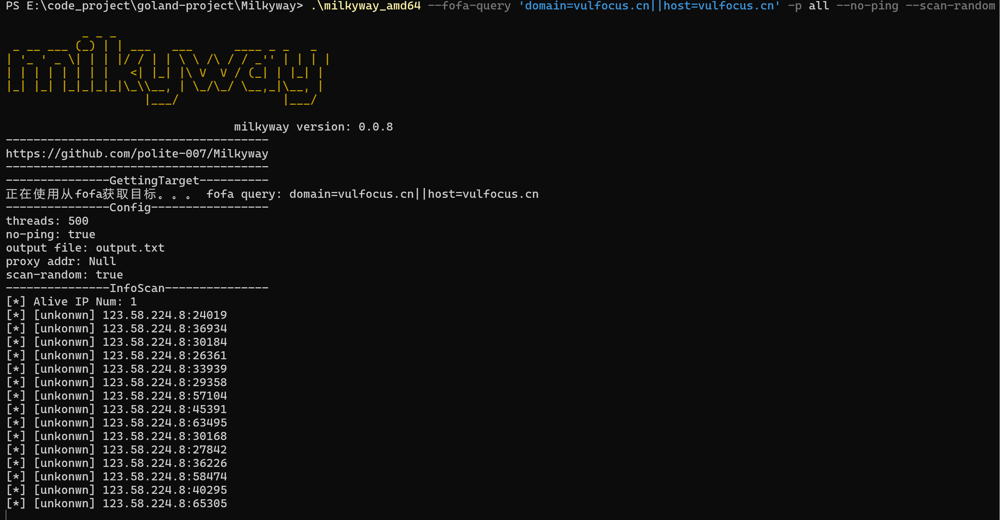
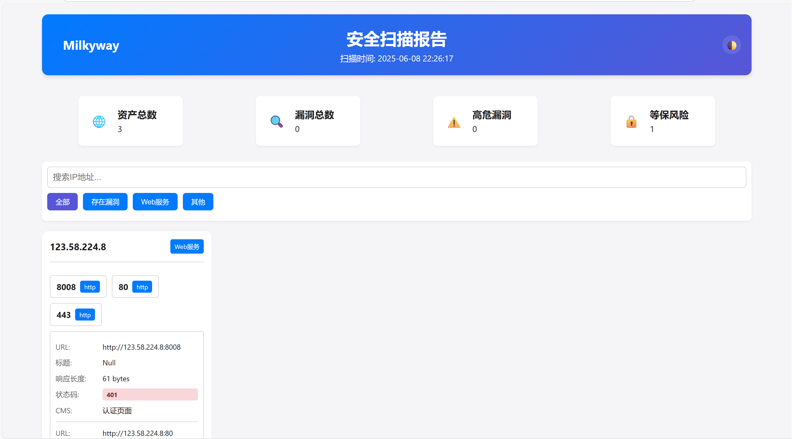

[English README](https://github.com/polite-007/Milkyway/blob/main/README_EN.md)
> 如果你觉得这款工具不错的话，求star~
<p align="center">
  
</p>

[](https://github.com/polite-007/Milkyway/releases/latest)[](https://github.com/polite-007/Milkyway/issues)

> 本工具仅供安全测试人员运用于授权测试, 禁止用于未授权测试, 违者责任自负

## 0x01 简介

一款全方位扫描工具，具备高效的机器探活，端口探活，协议识别，指纹识别，漏洞扫描等功能,

- 纯go实现的协议识别
- 丰富的扫描模式
  - 支持端口扫描的乱序 (目标越大，速度越快，准确度越高)
- release默认编译nuclei的8000+漏洞, 支持自定义poc
- web指纹25000+
- 优雅的html报告导出

## 0x02 主要功能

### 1. 信息收集
- 基于ICMP的主机探活,能够快速识别存活的主机
- 25000+的web指纹应用识别
- 支持web识别后的目录扫描
- 丰富的协议识别
  - `mysql`,`redis`,`smb`,`ldap`,`ssh`,`vnc`,`ftp`,`smtp`, `rdp`


### 2. 协议爆破
- 常用协议爆破 `ssh`,`mysql`,`redis`,`vnc`

### 3. 漏洞检测
- `redis`未授权
- 永恒之蓝/永恒之黑
- 内置`nuclei`漏洞引擎
- 自定义`poc`预加载目录或文件

### 4. 辅助功能
- 实时打印日志
- 自定义指纹文件加载
- `http`/`socks5`代理
- 支持`fofa`语句,目标从`fofa`拉取
- 支撑目标从`fofa`拉取目标

## 0x03 使用说明

**目标配置**
```
-t  指定目标(192.168.1.1/24, 192.168.1.1-192.168.1.128)
-u  指定url目标(http://www.baidu.com)
-f  从文件导入目标
-k  从fofa导入目标(-k 'domain=fofa.info')
```

**端口配置**
```
-p  指定端口(-p 22,80,3306 或者 -p 1-8080 or -p small)
  small:   常用前12个端口
  sql:     常用数据库端口
  all:     全端口
  company: 公司常用87个端口
```
 
**代理配置**
```
--socks5  指定socks5代理(如: socks5://127.0.0.1:1080)
--http-proxy  指定http代理(如: http://127.0.0.1:1080)
```

**扫描模式**（信息收集）
```
-c  设置并发量
-r  乱序扫描(扫描大量目标时, 推荐使用)
-k  设置fofa key
-n  跳过icmp扫描即ping
-a  跳过目录扫描
-v  打印识别出的协议内容
-l  协议全量识别(比如mysql只识别3306, 开启后每个协议会识别所有端口)
-w  自定义web指纹加载(默认使用内置web指纹, 格式文件请参考/static/finger_new.json)
-b  配置目录扫描的文件
```

**扫描模式**（漏洞扫描）
```
-x         禁用漏洞扫描
-m         不进行指纹匹配,对每个存活进行全量漏洞扫描
--poc-file 自定义poc文件/目录
--poc-tags 指定poc标签
--poc-id   指定poc id
```

## 0x04 演示案例

1. 利用fofa进行外网全端口打点,并且使用乱序扫描
   
   `milkyway.exe --fofa-query 'domain=fofa.info||host=fofa.info' -p all --no-ping --scan-random`

   
2. 设置1000并发量使用无序扫描内网所有端口

   `milkyway.exe -t 192.168.1.0/24 -p all --scan-random -c 1000 --no-ping`
   
   

## 0x05 参数使用

`milkyway.exe -t 192.168.1.1/24 -p company` (使用公司常用87个端口)

`milkyway.exe -t 192.168.1.1/24 -p small --full-scan` (对前12个端口进行全协议识别)

`milkyway.exe -t 192.168.1.1/24 --no-ping` (跳过icmp扫描)

`milkyway.exe -t 192.168.1.1/24 --finger-file ./your_file` (自定义指纹文件)

`milkyway.exe -t 192.168.1.1/24 --verbose` (打印协议详细信息)

`milkyway.exe -t 192.168.1.1/24 --no-match` (漏洞扫描不进行指纹匹配,即下发全量)

`milkyway.exe -t 192.168.1.1/24 --poc-file ./your_file` (自定义漏洞目录)

`milkyway.exe -t 192.168.1.1/24 --poc-tags cve,cnvd` (指定多个poc标签)

> `sql`: 常用数据库端口, `small`: 常用前12个端口, `all`: 全端口

## 0x06 运行截图





**特别鸣谢～FOFA官方**

Milkyway 已加入 FOFA [共创者计划](https://fofa.info/development)，感谢 FOFA 提供的账号支持。


***
# 参考项目
https://github.com/shadow1ng/fscan

https://github.com/EdgeSecurityTeam/EHole

https://github.com/chainreactors/neutron

